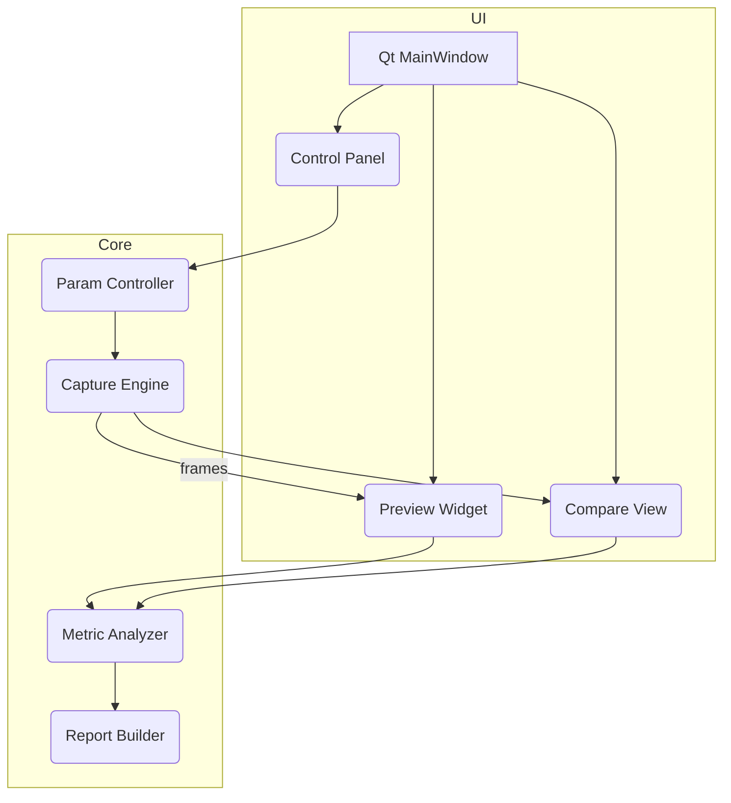

# Camera Tuner GUI — 기능 설계서 v0.1
> 간편한 UI에서 노출·게인·ISP 등 파라미터를 실시간 조절하고,  
> 서로 다른 카메라(또는 동일 카메라의 설정 A/B)를 정성·정량적으로 비교·평가하는 툴

---

## 1. 목표(Goal)
- **실시간 미리보기 + 슬라이더 조절**로 카메라 성능(해상도, 노이즈, 플리커, 모션블러)을 즉석에서 최적화
- **멀티-스트림 비교** (좌/우·Picture-in-Picture)로 센서·렌즈·설정 차이를 한눈에 확인
- **정량 지표 계산** (MTF50, SNR, ΔL, FPS)과 **정성 오버레이** (히스토그램, Focus Peaking) 동시 제공
- 버튼 한 번으로 **리포트(PDF/HTML) 출력** + 파라미터 프리셋(`.json`) 저장/불러오기

## 2. 범위(Scope)
| 포함 | 제외 |
|------|------|
| UVC /V4L2 및 벤더 SDK 카메라 연결 · 파라미터 제어 | 딥러닝 모델 학습/추론 파이프라인 |
| Qt 기반 GUI, 멀티캠 프리뷰, 슬라이더 · 토글 · ROI 툴 | 윈도우·macOS 포팅(1차 버전은 Linux) |
| OpenCV / NumPy 지표 계산 모듈 | HW-accelerated 고급 ISP(후속 단계) |
| HTML→PDF 리포트, 세션·프리셋 관리 | Web-backend 서버·클라우드 저장소 |

## 3. 핵심 사용자 시나리오
| ID | 시나리오 | 성공 조건 |
|----|----------|-----------|
| **UC-LIVE-TUNE** | 엔지니어가 로봇 현장에서 슬라이더로 노출·게인을 조정하며 라이브 뷰 확인 | 원하는 밝기·블러 도달, 지표 ‘PASS’ 메시지 |
| **UC-A/B-COMPARE** | 두 카메라(또는 설정) 영상을 Split-view로 비교 | 지표 차이표 + 화면 스냅 저장 |
| **UC-REPORT** | 튜닝 완료 후 ‘리포트 내보내기’ | PDF에 이미지·파라미터·지표 표 포함 |

## 4. 아키텍처 개요


## 5. 모듈 & API

| 모듈 | 주요 클래스/함수 | 핵심 책임 |
| --- | --- | --- |
| `capture` | `CameraDevice`, `GstPipeline` | 장치 탐색, 프레임 캡처 스트림 |
| `control` | `ParamMap`, `set_param(id,val)` | 슬라이더 ↔ V4L2/SDK 매핑 |
| `metric` | `calc_mtf50`, `calc_snr`, `detect_flicker` | 정량 지표 산출 |
| `ui` | `MainWindow`, `CompareDock` | Qt 위젯, 단축키, 히스토그램 |
| `report` | `render_html`, `export_pdf` | 세션 요약 저장 |
| `preset` | `save_json`, `load_json` | 파라미터 프리셋 관리 |

## 6. 핵심 파라미터(초기)

- **노출** `exposure_abs` (100 µs 단위)
- **FPS / Frame Interval**
- **아날로그 게인·디지털 게인**
- **화이트밸런스 (케빈) / AWB 토글**
- **Power-line Frequency** (Off/50/60)
- **ISP Denoise Strength**, **Sharpen Strength**
- **ROI / Binning** (x,y,w,h or mode)

## 7. 지표 & PASS/FAIL 기준 (가변)

| 지표 | 계산식/라이브러리 | 기본 통과값 |
| --- | --- | --- |
| **MTF50(px)** | slanted-edge (OpenCV) | ≥ 2 px at 720p |
| **SNR(dB)** | 20 log10(μ/σ) | ≥ 20 dB |
| **ΔL 플리커(%)** | frame-to-frame mean diff | ≤ 3 % |
| **실효 FPS** | 프레임 타임 측정 | ≥ 목표 − 2 fps |

## 8. UI 설계 스케치

```
less
CopyEdit
┌──────────────── MainWindow ────────────────┐
│  Device Combo  [ Start ] [ Stop ]          │
│────────────────────────────────────────────│
│ Preview | Compare │  Hist  │  Controls ▼   │
│  ┌────────────┐   ┌───────────┐           │
│  │ live view  │   │ snapshot  │           │
│  └────────────┘   └───────────┘           │
│  ───────── Sliders / Toggles ───────────   │
│  Exposure ▐■■■■       2.5 ms              │
│  Gain     ▐■■          8 dB              │
│  WB Kelvin  4500 K                       │
│  ...                                     │
│────────────────────────────────────────────│
│  [ Snapshot ]   [ Export Report ]          │
└────────────────────────────────────────────┘

```

## 9. 개발 로드맵

| 단계 | 목표 | 완료 기준 |
| --- | --- | --- |
| **M0** | 싱글 카메라 프리뷰 + 노출·게인 슬라이더 | 720p30 미리보기, SNR 지표 출력 |
| **M1** | 멀티캠 Split-view + 스냅샷 · MTF50 계산 | 두 스트림 동시 표시, 비교 지표 표 |
| **M2** | 프리셋 저장/로드, 리포트 HTML→PDF | `*.json` 프리셋, 1-클릭 PDF |
| **M3** | 플러그인 SDK 어댑터·고FPS 최적화 | AR0234 USB3 모듈 120 fps 지원 |

## 10. 기술 스택

- **Python 3.10+** 언어 / 빠른 프로토타입
- **PySide 6 (Qt 6)** GUI · 멀티윈도우
- **GStreamer 1.20** UVC/MIPI 파이프라인 (`v4l2src ! glsinkbin`)
- **OpenCV 4 / NumPy / scikit-image** 지표 계산
- **pyuvc + ioctl(ctypes)** 파라미터 제어 어댑터
- **Jinja2 + WeasyPrint** HTML → PDF 리포트
- **PyInstaller / AppImage** 단일 파일 배포

---

## 11. 향후 확장 아이디어

- **C++/CUDA 가속 플러그인** (MTF, YUV-RGGB 변환)
- **WebSocket API** → 로봇 제어 앱에서 원격 조절
- **YOLO 등 딥러닝 인식 FPS 바로측정**
- **Cross-platform** : Windows용 DirectShow backend 추가

---

### Appendix A. 센서 후보 메타데이터(예시 CSV)

| model | res | max_fps | shutter | iface | notes |
| --- | --- | --- | --- | --- | --- |
| AR0114 | 1280×800 | 60 | GS | USB2 | 저전력 |
| AR0234 | 1920×1200 | 120 | GS | USB3 | 해상도·FPS 우수 |
| OV9782 | 1280×800 | 60 | GS | USB2 | 소형, 저가 |
